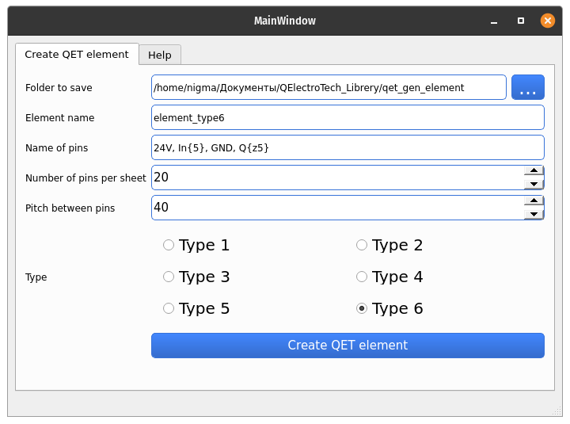
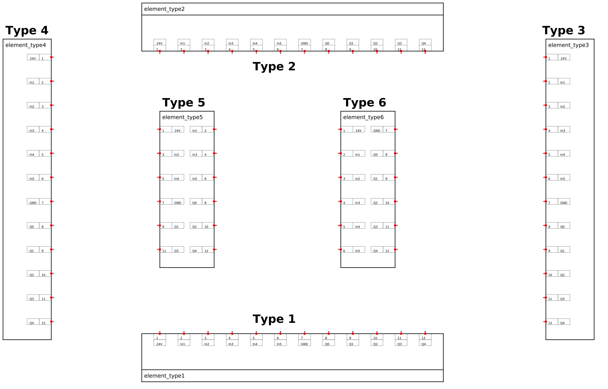

Description of the Project
Allows you to create elements for the QElectroTech electrical schematic software.
Window for setting parameters of elements

Pin names are separated by commas. If necessary, you can specify the number of repetitions in curly braces. To **In{5} -> 'In1', 'In2', 'In3', 'In4', 'In5'**. If you need the numbering to start from zero there is a key z, example **Q{z5} -> 'Q0', 'Q1', 'Q2', 'Q3', 'Q4'**
6 types of pin layout are possible

